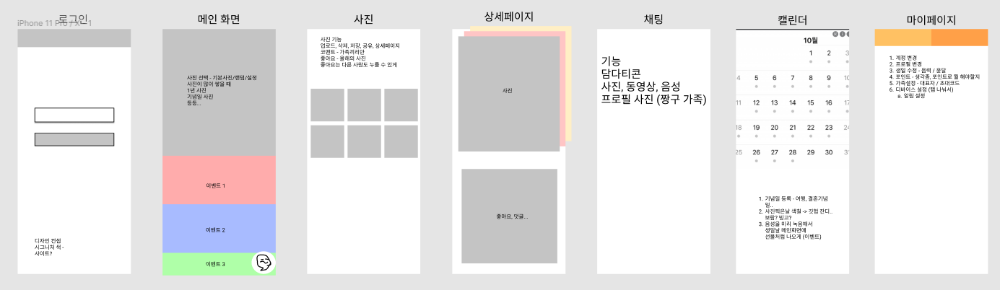

# 프로젝트 계획

## 목차

* [프로젝트 주제](#프로젝트-주제)
* [기술스택](#기술스택)
* [와이어 프레임](#와이어-프레임)

## 프로젝트 주제

[참고 글](https://pann.nate.com/talk/342915834)

모바일 어플리케이션 + 웹에서도 사용 가능

## 기술스택

### PWA(Progressive Web Apps)

### FE

> React, TypeScript, NextJS, Redux, Redux-saga

#### React

가장 많이 사용되는 프론트앤드 라이브러리

#### TypeScript

JS의 단점을 보완

#### NextJS

SSR, SSG 선택해서 사용 가능

NextJS

#### Redux

Redux

#### Redux-saga

Redux-saga

### BE

> Java Spring boot, Gradle, lombok

#### Java Spring boot

국내에서 가장 많이 사용되는 BE 프레임워크

Java

#### Gradle

Gradle

#### lombok

getter, setter 편하게

### DB

> DynamoDB(NoSQL)

#### DynamoDB(NoSQL)

AWS free tier

무료로 사용가능, 충분한 크기

### 배포

AWS amplify, Lambda

## 와이어 프레임

1. 가족 앨범 - 인스타 느낌...
2. 숏컷 동영상 
3. 게시글(폴더)에 공개 권한 -> 초대 링크 생성
4. 채팅방
5. 회원가입/로그인 (소셜 로그인)
